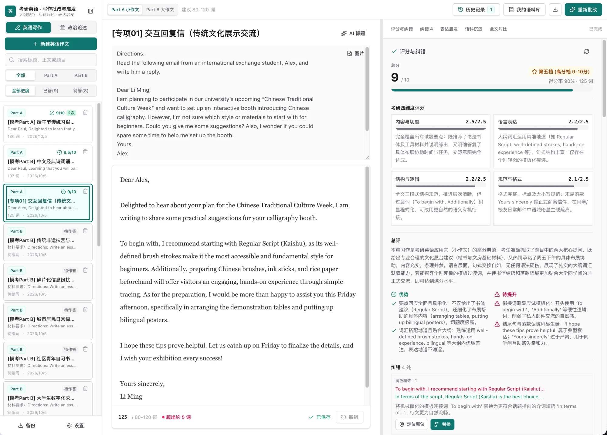

# EssayPilot · 考研作文工作台

考研英语写作与政治主观题的 AI 评分、纠错、表达启发与语料沉淀。

**Cloudflare Workers + D1 · Hono · Astro + React · TypeScript**



## 特性

- **评分与纠错**：按考研四维标准打分，逐处给出润色与可一键替换的修改。
- **表达启发与语料沉淀**：从作答中提炼金句 / 模板，沉淀到个人语料库。
- **版本历史与全文对比**：每次评分保留快照，可对比、可回退。
- **英语 / 政治双科目**：评分维度、纠错类别、篇幅规则按科目查表区分。
- **自带模型**：兼容 OpenAI 接口的任意服务，密钥只存服务端。

## 快速开始

```bash
pnpm install
pnpm db:migrate     # 本地 D1 建表
pnpm db:seed        # 可选：写入示例
pnpm dev            # http://localhost:4321
```

在页面「设置」里填写模型服务即可使用。需要 Node.js 22+ 与 pnpm。

## 结构

```
packages/domain   领域模型（仅依赖 zod）
apps/api          Hono Worker：REST API + 托管前端，数据存 D1（Drizzle）
apps/web          Astro 静态站点，React 岛屿渲染工作台
```

## 文档

- [架构](docs/architecture.md)
- [API](docs/api.md)
- [开发](docs/development.md)
- [部署](docs/deployment.md)

> 应用本身没有登录。部署到公网前请用 Cloudflare Access 等方式保护站点。

## 贡献与许可

参见 [CONTRIBUTING.md](CONTRIBUTING.md)。以 [MIT](LICENSE) 许可发布。
